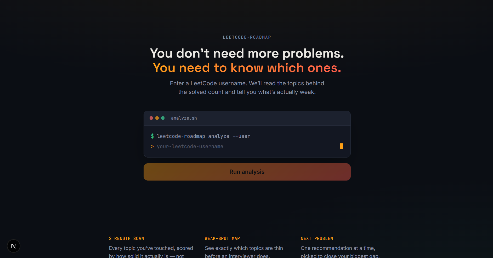
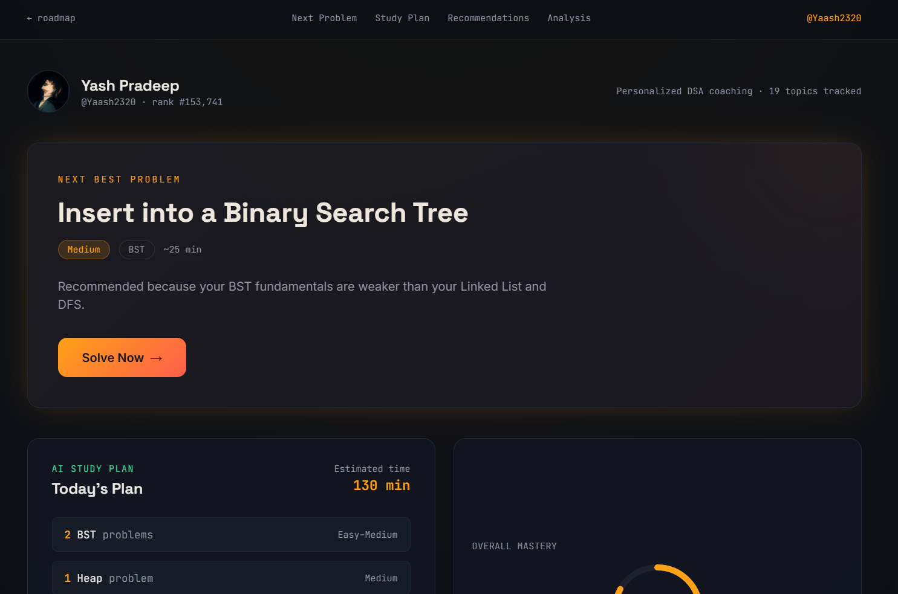
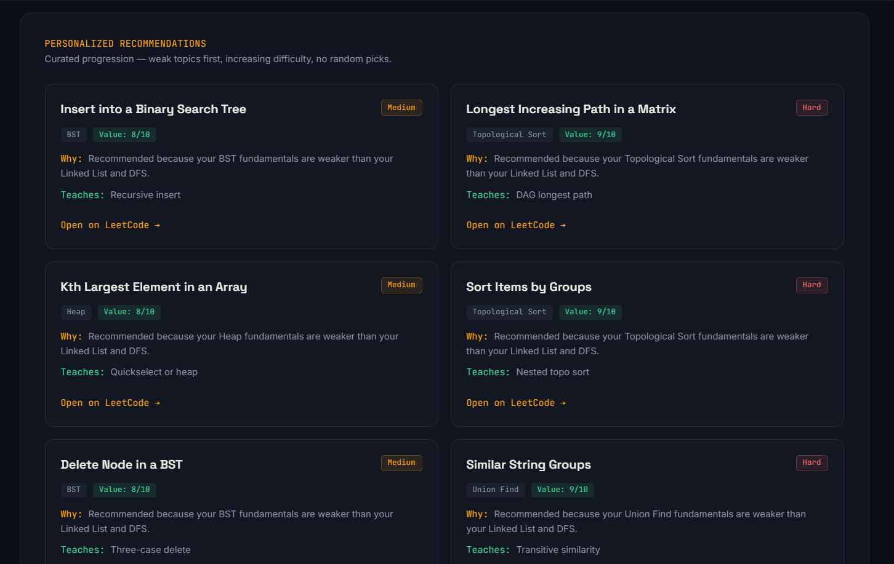
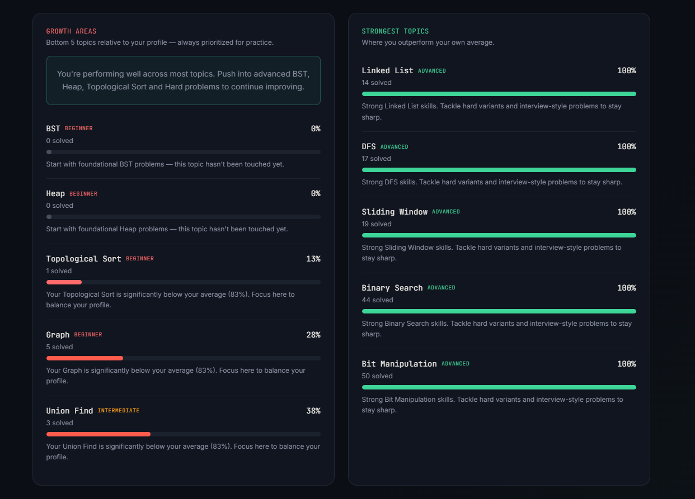

# LeetCode Coach — Phase 1

A personalized DSA roadmap and problem recommendation platform that analyzes your LeetCode profile and tells you exactly what to solve next.
The MVP slice: enter a LeetCode username, see real solved-problem stats and a
topic-by-topic strength/weakness breakdown. No database, no recommendations
engine yet, no auth — those are Phase 2+.

## ✨ Preview

### Landing Page
<div align="center">

</div>

### Dashboard
<div align="center">

</div>

### Recommendations
<div align="center">

</div>

### Analysis
<div align="center">

</div>

## Run it

```bash
npm install
npm run dev
```

Open http://localhost:3000, type a real LeetCode username, hit **Run analysis**.

## How it's wired

- `lib/leetcode/queries.ts` — the GraphQL query sent to LeetCode
- `lib/leetcode/client.ts` — calls `https://leetcode.com/graphql/` server-side
  and normalizes the response. **This file is the one most likely to need
  updates** if LeetCode changes their schema — it's unofficial and undocumented.
- `app/api/leetcode/profile/route.ts` — the API route the frontend actually
  calls. Caches responses in-memory for 5 minutes (`lib/cache.ts`) so you're
  not hitting LeetCode on every page refresh.
- `lib/leetcode/analyze.ts` — turns raw topic counts into Strong / Weak labels.
  The scoring thresholds in here are a heuristic (see comment in the file) —
  worth revisiting once Phase 2 pulls real per-tag totals from
  `problemsetQuestionList`.
- `app/dashboard/[username]/page.tsx` — fetches from the API route client-side,
  handles loading/error/ready states.

## If requests to LeetCode get blocked

This endpoint isn't officially supported, and LeetCode's edge (Cloudflare)
does reject requests that don't look like they came from a real browser.
`client.ts` already sets `Referer`, `Origin`, and a browser `User-Agent` —
if you still get blocked from your machine:

1. Confirm you're not behind a proxy/VPN that's also getting flagged.
2. Try the request from Postman/Insomnia first to confirm it's not your code.
3. If LeetCode is rate-limiting you specifically, wait a few minutes — the
   5-minute cache means you shouldn't hit this often during normal use.

## What's deliberately not here yet

- No persistence — restart the server, the cache is gone. Phase 2 adds
  Prisma + SQLite for this.
- No recommendation engine — the "what to solve next" card depends on
  `problemsetQuestionList` data we haven't ingested yet.
- No auth, no saved profiles, no AI calls.

See the full phase breakdown from planning if you want the bigger picture —
this repo is Phase 1 only, on purpose.
